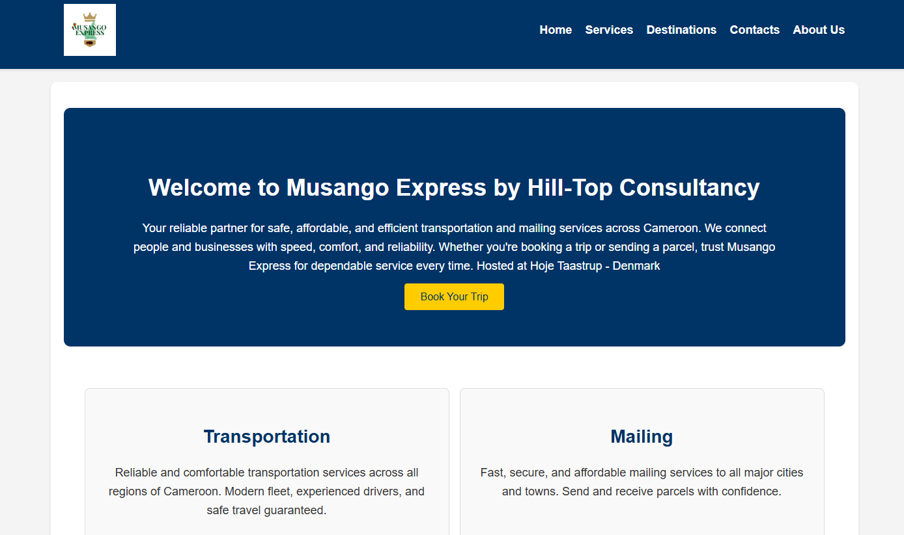

## **Musango Express Ticket Management App**

### **Overview**
Musango Express is a web-based ticket booking application that allows users to book and manage their tickets online. The app is built using the following technologies:
- **Backend**: Node.js with Express
- **Frontend**: EJS (Embedded JavaScript templates)
- **Database**: MongoDB
- **Containerization**: Docker
- 

---

## **Running the App Locally on Ubuntu EC2**
- Launch an Ubuntu Instance of size t2.medium
- Open port 8080, 22, 80

### **1. SSH into your EC2 instance**
```bash
ssh -i key.pem ubuntu@your-ec2-public-ip
```

### **2. Install Node.js and npm Command Utility**
```bash
sudo apt update
sudo apt install nodejs npm -y
```

### **3. Install Docker (for MongoDB container)**
```bash
sudo apt install docker.io -y
sudo systemctl start docker
sudo systemctl enable docker
```

### **4. Clone the Repository**
```bash
git clone https://github.com/HILL-TOPCONSULTANCY/musango-app.git
cd musango-app
```
- ### Add docker user to sudo
```bash
sudo usermod -aG docker ubuntu
newgrp docker
```

### **5. Run MongoDB as a Docker Container**
```bash
sudo docker run -d --name mongodb -p 27017:27017 -e MONGO_INITDB_DATABASE=musango-express mongo:6
```

### **6. Install Dependencies and Start the App**
```bash
npm install
npm install puppeteer ejs nodemailer
```
### **7. Test Database Connection
```bash
node test-db.js
```
### Run Test
```bash
npm test
```
## Deploy Application
```bash
npm run start
```
### **8. Access the App**
Copy the Public IPV4 of your instance and Open your browser and visit:
```
http://<PublicIP>:8080
```

---

## **Running the App with Docker**

### **1. Build the Docker Image**
```bash
docker build -t musango .
```

### **2. Run MongoDB in Docker**
```bash
docker run -d --name mongodb -p 27017:27017 -e MONGO_INITDB_DATABASE=musango-express mongo:6
```

### **3. Run Musango Express App**
```bash
docker run -d -p 8080:8080 --link mongodb:mongodb -e MONGO_URI=mongodb://mongodb:27017/musango-express musango
```

### **4. Access the App**
```
http://localhost:8080
```

---

## **Deploying on Kubernetes**

### **1. Prerequisites**
- A running Kubernetes cluster (EKS, Minikube, etc.)
- `kubectl` installed and configured

### **2. Create Kubernetes Deployment and Service Files**

#### **MongoDB Deployment and Service**
Create `mongo-deployment.yaml`:
```yaml
apiVersion: apps/v1
kind: Deployment
metadata:
  name: mongodb
spec:
  replicas: 1
  selector:
    matchLabels:
      app: mongodb
  template:
    metadata:
      labels:
        app: mongodb
    spec:
      containers:
      - name: mongodb
        image: mongo:6
        ports:
        - containerPort: 27017
        env:
        - name: MONGO_INITDB_DATABASE
          value: "musango-express"
---
apiVersion: v1
kind: Service
metadata:
  name: mongodb
spec:
  selector:
    app: mongodb
  ports:
    - protocol: TCP
      port: 27017
      targetPort: 27017
```

#### **Musango Express Deployment and Service**
Create `musango-deployment.yaml`:
```yaml
apiVersion: apps/v1
kind: Deployment
metadata:
  name: musango
spec:
  replicas: 1
  selector:
    matchLabels:
      app: musango
  template:
    metadata:
      labels:
        app: musango
    spec:
      containers:
      - name: musango
        image: musango
        ports:
        - containerPort: 8080
        env:
        - name: MONGO_URI
          value: "mongodb://mongodb:27017/musango-express"
        - name: PORT
          value: "8080"
---
apiVersion: v1
kind: Service
metadata:
  name: musango
spec:
  type: NodePort
  selector:
    app: musango
  ports:
    - protocol: TCP
      port: 8080
      targetPort: 8080
      nodePort: 30000
```

### **3. Deploy to Kubernetes**
```bash
kubectl apply -f mongo-deployment.yaml
kubectl apply -f musango-deployment.yaml
```

### **4. Access the App**
Visit:
```
http://<your-cluster-node-ip>:30000
```

---

### ✅ You're now ready to use Musango Express!
